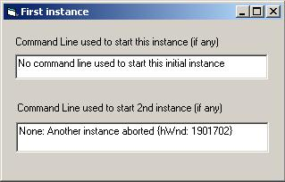



## FYI: Previous Instance &amp; Command Line Passing

### Description

Edited to expand comments &amp; samples: Just one of many ways to check for previous instances across processes, that can also pass command line parameters used to start another instance. By now, many of you realize that App.PrevInstance doesn't work all the time. This version is a non-subclassing approach, a subclassing approach may be slightly cleaner. Compile sample project and test.
 
### More Info
 

             |
---                |---
**Submitted On**   |2006-06-24 10:46:46
**By**             |[LaVolpe](https://github.com/Planet-Source-Code/PSCIndex/blob/master/ByAuthor/lavolpe.md)
**Level**          |Intermediate
**User Rating**    |5.0 (45 globes from 9 users)
**Compatibility**  |VB 5\.0, VB 6\.0
**Category**       |[Miscellaneous](https://github.com/Planet-Source-Code/PSCIndex/blob/master/ByCategory/miscellaneous__1-1.md)
**World**          |[Visual Basic](https://github.com/Planet-Source-Code/PSCIndex/blob/master/ByWorld/visual-basic.md)
**Archive File**   |[FYI\_\_Previ2002436242006\.zip](https://github.com/Planet-Source-Code/lavolpe-fyi-previous-instance-amp-command-line-passing__1-65750/archive/master.zip)

